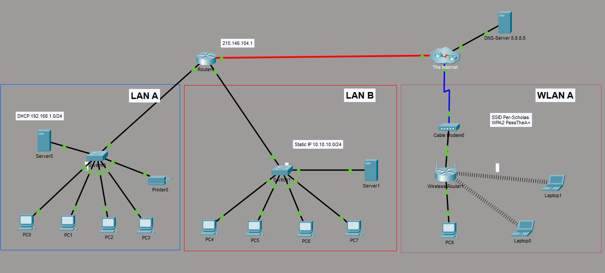
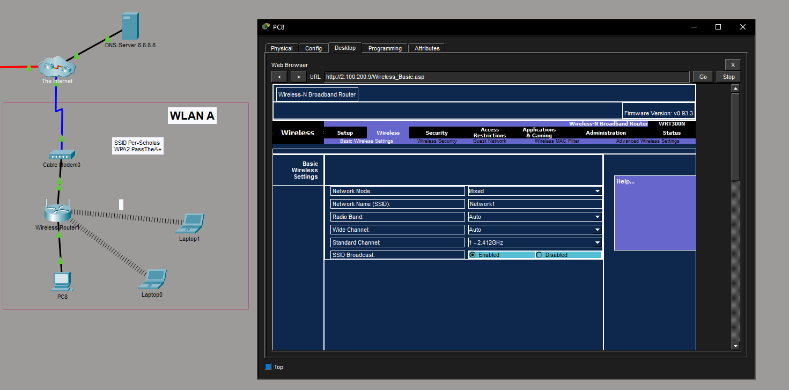
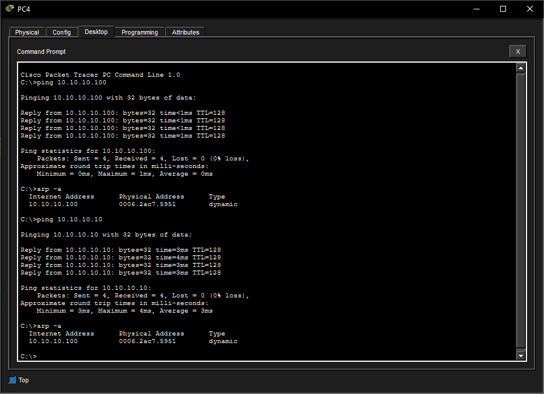

# Network Segmentation & Wireless Configuration Lab (Packet Tracer)

## Overview

This lab focused on designing, configuring, and troubleshooting a segmented network using Cisco Packet Tracer.

The network included:
- LAN A (DHCP)
- LAN B (static IP)
- WLAN (secured wireless)

---

## Network Topology

---

## Network Design

### LAN A
- 192.168.1.0/24
- DHCP enabled

### LAN B
- 10.10.10.0/24
- Static IPs
- Server1: 10.10.10.100

### WLAN
- Custom SSID
- WPA2-Personal security

---

## Key Configurations

- Static IP configuration for LAN B
- Default gateways:
  - 192.168.1.254
  - 10.10.10.254
- DNS: 8.8.8.8
- WPA2 wireless security implemented

---

## Troubleshooting Process

### Issue
LAN B devices could not reach Server1.

---

### Step 1: Connectivity Test

Command: ping 10.10.10.100

Result:
- Request timed out

---

### Step 2: Gateway Test

Command: ping 10.10.10.254

Result:
- Successful reply

Conclusion:
- Local network and router were working

---

### Step 3: ARP Check

Command: arp -a

Observation:
- Server1 MAC address was not present

Conclusion:
- Server1 was not responding at Layer 2

---

### Root Cause

Server1 was not properly connected or configured.

---

### Resolution

- Enabled Server1 network interface
- Reconfigured IP settings
- Reconnected cable

---

## Verification

Command: ping 10.10.10.100

Result:
- Successful reply

Web access:
http://10.10.10.100

---

## Key Takeaways

- ARP is required for local communication
- Layered troubleshooting is critical
- Gateway success does not mean full connectivity
- Proper IP configuration is essential

---

## Skills Demonstrated

- Network segmentation
- IP configuration (static + DHCP)
- Wireless security (WPA2)
- Troubleshooting (Layer 2 / Layer 3)
- Diagnostic tools (ping, arp)
